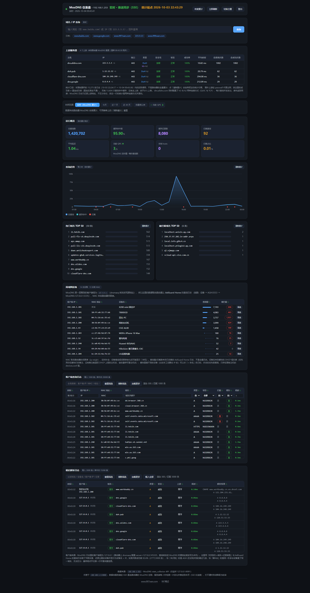
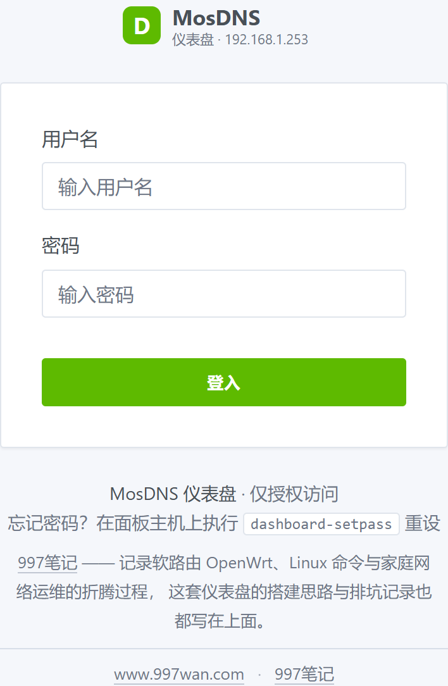

# MosDNS 仪表盘

给 OpenWrt 上的 [MosDNS](https://github.com/IrineSistiana/mosdns) 做一个**自带实时推送、能按设备统计**的 DNS 查询面板。

**纯 Python 3 标准库实现，零第三方依赖。** 不需要 pip install 任何东西，`git clone` 下来改两行配置就能跑。

> 镜像：[GitHub](https://github.com/996kuku/mosdns-dashboard)（国际版）· [Gitee](https://gitee.com/yilunn996/mosdns-dashboard)（国内版）

> 配套的上游是 `sbwml/luci-app-mosdns`（OpenWrt 上的 LuCI 包）。本面板不参与解析、不改路由器任何配置 —— 它只是**读** MosDNS 的统计接口，然后把数据攒进本地 SQLite 展示出来。

---

## 截图

主面板（整页，点开看大图）：



登录页：



> 截图里的内网网段已替换成 `192.168.1.x` 示例值，其余是真实运行数据。

---

## 它解决什么问题

| MosDNS 自带能力 | 缺什么 | 本面板补上什么 |
|---|---|---|
| stats API 只有累加计数 | 没有明细、没有历史、重启就丢 | SQLite 落库，支持 today / 7d / 30d / 永久累计 |
| 日志文件里 `client` 恒为 `127.0.0.1` | **看不出是哪台设备查的**（请求是本机 dnsmasq 转发进来的） | 用 AdGuard Home 的 querylog 按 `(时间, 域名, 查询类型)` 反查真实客户端 IP，实测命中率约 98.7% |
| — | 没有 MAC / 设备名 | 拉 iKuai（爱快）DHCP 租约表补上，再叠加一个手写 `devices.conf` 兜底 |
| 只有"现在"的数字 | 想看趋势 | SSE 实时推送（约 2 秒一帧），数据有变化才广播 |

---

## 特性

- **实时**：SSE 长连接推送，指纹变了才广播（没人看时自动降到 10 秒一轮，不空转）
- **按设备统计**：客户端 IP / MAC / 设备名 / 查询量
- **上游服务器表**：清单的权威来源是路由器上的 `/var/etc/mosdns.json`（`forward` 插件的 `upstreams`），所以**配了但一次没用过的备用上游也会列出来**；再叠加上成功率、平均耗时、总查询数
- **两张日志表**：MosDNS 解析日志 + AGH 客户端查询日志，均可搜索 / 排序 / 逐列筛选
- **"清除重计"按模块独立**：可以只重置 TOP 榜、或只重置统计，互不影响；清完从那一刻重新计数，方便盯一段时间
- **8088 单端口同时收 HTTPS 和 HTTP**：明文请求自动 301 跳 HTTPS（accept 后 peek 首字节判断，和 nginx 的 `ssl_preread` 一个思路）
- **登录认证**：PBKDF2 存密码，cookie 用 HMAC-SHA256 签名（HttpOnly / SameSite=Lax / Secure）
- **零依赖**：只用 Python 标准库

---

## 数据来源

```
┌─────────────────────────┐
│  路由器（MosDNS）        │  stats_collector API 127.0.0.1:9091
│  + AdGuard Home          │  querylog → 反查真实客户端 IP
│  + iKuai（可选）         │  DHCP 租约 → MAC / 设备名
└───────────┬─────────────┘
            │ SSH（只读，专用 key）
            ▼
┌─────────────────────────┐
│  面板主机（Python 3）    │  SQLite 落库 + SSE 推送
│  监听 :8088 (HTTPS)      │
└─────────────────────────┘
```

面板对路由器**只做只读操作**：SSH 过去读一个 JSON、拉一次 querylog、查一次邻居表，不写任何东西。

---

## 前置条件

1. **Python 3.9+**（无需 pip 安装任何包）
2. **到路由器的 SSH 免密登录**，建议单独生成一把只读用途的 key
3. **MosDNS 开启 stats_collector API** —— `luci-app-mosdns` 默认开启，监听 `127.0.0.1:9091`

---

## 安装

```bash
# 1. 放代码
git clone <你的仓库地址> /opt/mosdns-dashboard
cd /opt/mosdns-dashboard

# 2. 建配置（四个 .example 复制过去即可，AGH / iKuai / devices 不配也能跑）
cp auth.conf.example    auth.conf    && chmod 600 auth.conf
cp agh.conf.example     agh.conf     && chmod 600 agh.conf      # 可选
cp ikuai.conf.example   ikuai.conf   && chmod 600 ikuai.conf    # 可选
cp devices.conf.example devices.conf                            # 可选

# 3. 设登录密码（会写入 auth.conf 的 AUTH_HASH / AUTH_SECRET）
./tools/dashboard-setpass

# 4. SSH key（面板要用它连路由器）
ssh-keygen -t ed25519 -f /root/.ssh/id_ed25519_mosdns -N ''
ssh-copy-id -i /root/.ssh/id_ed25519_mosdns root@<路由器IP>

# 5. 装服务
cp deploy/mosdns-dashboard.service /etc/systemd/system/
systemctl daemon-reload
systemctl enable --now mosdns-dashboard
```

默认监听 `0.0.0.0:8088`。没配证书时会自动回退成明文 HTTP（日志里会明确写一句）。

---

## 配置

### 环境变量

| 变量 | 默认值 | 说明 |
|---|---|---|
| `DASH_HOST` | `0.0.0.0` | 监听地址 |
| `DASH_PORT` | `8088` | 监听端口 |
| `DASH_TLS_CERT` | `/opt/mosdns-dashboard/ssl/server.pem` | TLS 证书链 |
| `DASH_TLS_KEY` | `/opt/mosdns-dashboard/ssl/server.key` | TLS 私钥 |
| `MOSDNS_HOST` | `192.168.1.1` | 路由器 IP |
| `MOSDNS_USER` | `root` | SSH 用户名 |
| `MOSDNS_SSH_KEY` | `/root/.ssh/id_ed25519_mosdns` | SSH 私钥路径 |
| `INGEST_INTERVAL` | `5` | 采集间隔（秒） |
| `PUSH_INTERVAL` | `2` | 有人在看时的 SSE 采样间隔（秒） |
| `PUSH_IDLE_INTERVAL` | `10` | 没人看时的采样间隔（秒） |
| `UP_CFG_TTL` | `60` | 上游清单配置缓存（秒） |

建议写进 systemd drop-in（模板见 `deploy/mosdns-dashboard.service` 末尾注释）。

### 配置文件

| 文件 | 必需 | 作用 | 缺失时 |
|---|---|---|---|
| `auth.conf` | 否 | 登录认证 | 不启用认证（任何人可看） |
| `agh.conf` | 否 | 反查真实客户端 IP | 客户端列拿不到真实 IP |
| `ikuai.conf` | 否 | MAC / 设备名 | 没有 MAC 列 |
| `devices.conf` | 否 | IP → 设备名手写映射 | 无 |

---

## HTTPS

面板在**同一个端口**同时收 HTTPS 和 HTTP：accept 之后 peek 首字节，是 TLS 握手（`0x16`）就 wrap 成 TLS，不是就回 301 跳到 HTTPS。所以直接访问 `http://host:8088/` 也会被带过去。

自签证书举例：

```bash
mkdir -p /opt/mosdns-dashboard/ssl
openssl req -x509 -newkey rsa:2048 -nodes \
  -keyout /opt/mosdns-dashboard/ssl/server.key \
  -out    /opt/mosdns-dashboard/ssl/server.pem \
  -days 3650 -subj "/CN=mosdns-dashboard"
```

有正式证书（Let's Encrypt 等）就用 `DASH_TLS_CERT` / `DASH_TLS_KEY` 指过去。

---

## 网站图标

`static/logo/` 下的第三方网站 favicon **不在仓库里**（版权归各自站点）。部署后按需抓取：

```bash
./tools/fetch-logos.py -n 200 -j 16
```

想自动更新的话挂个 cron，例如每小时一次：

```
17 * * * * /opt/mosdns-dashboard/tools/fetch-logos.py -n 200 -j 16 >> /var/log/dashboard-logos.log 2>&1
```

抓不到图标时界面会退化成首字母色块，不影响使用。

---

## ⚠️ 安全提醒（部署到公网前必读）

1. **默认要登录**。`auth.conf` 缺失或 `AUTH_ENABLE != 1` 时面板对任何人开放 —— 而面板里是**你家所有设备的完整上网记录**。
2. **不要把 `AUTH_LAN_FREE=1` 和反向代理一起用**。面板判定"内网"靠的是 socket 远端地址；一旦前面挂了 nginx / frp 之类的反向代理，服务端看到的来源 IP 恒为 `127.0.0.1`，"内网免登录"就变成了**对全网放行**。要按来源放行，必须先让代理层把真实 IP 传进来（`proxy_protocol` 或 `X-Forwarded-For`），并且**验证过它真的生效**。
3. **`logs.db` 绝对不要提交到任何地方**。里面是真实的域名查询历史。仓库的 `.gitignore` 已经排除它了。
4. 面板本身不做访问控制之外的加固，暴露到公网请自行加一层（防火墙 / Basic Auth / VPN）。

---

## 常见问题

**Q：客户端那一列全是 `127.0.0.1`？**
MosDNS 日志里的 `client` 确实是本机（dnsmasq 转进来的）。要真实 IP 必须配 `agh.conf`，让面板用 AGH 的 querylog 去反查。

**Q：上游服务器表里某个上游一直是 0？**
清单来自路由器的 MosDNS 配置，所以"配了没用过"的上游也会列出来（这是故意的）。统计来自本地日志库，只有真的发出过查询才有数。

**Q：改了路由器的 MosDNS 配置，面板多久能看到？**
上游清单缓存默认 60 秒（`UP_CFG_TTL`），不用重启面板。

**Q：支持 HEAD 请求吗？**
支持。路由复用 `do_GET`，但响应头发完就不写 body；`/api/stream`（SSE 长连接）、`/api/clear`（会重置统计）、`/api/logout`（会注销 cookie）这三个例外直接返回 405，因为 HEAD 按规范必须是安全且无副作用的。

---

## 许可证

[MIT](LICENSE)
